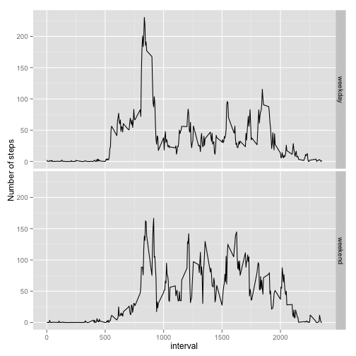

# Reproducible Research: Peer Assessment 1


## Loading and preprocessing the data


```r
## Load the data
unzip("activity.zip")
activity <- read.csv("activity.csv")
## Convert the date
activity$date <- as.Date(activity$date)
```


## What is mean total number of steps taken per day?


```r
## Aggregate the steps per date
daily_steps <- aggregate(steps ~ date, data=activity, sum)
steps <- daily_steps$steps
## Draw histogram
hist(steps)
```

 

Mean total number of steps taken per day:

```r
mean(steps)
```

```
## [1] 10766
```

Median total number of steps taken per day:

```r
median(steps)
```

```
## [1] 10765
```

## What is the average daily activity pattern?


```r
plot(daily_steps$date, daily_steps$steps, type="l", main="Average daily activity pattern", xlab="Days", ylab="Steps")
```

 

We then calculate which interval get the maximum number of steps:


```r
## Mean the steps per intervals
steps_by_interval <- aggregate(steps ~ interval, data=activity, mean)
## Get the interval
m <- max(steps_by_interval$steps)
steps_by_interval[steps_by_interval$steps==m,1]
```

```
## [1] 835
```

## Imputing missing values

We calculate the total number of missing values in the dataset:


```r
## Count number of NAs
nas <- is.na(activity$steps)
sum(nas)
```

```
## [1] 2304
```

We choose to replace NA values as the mean of the 5 minutes interval of the record. 

```r
## copy dataframe
activity_filled <- activity
interval_vector <- activity[nas==TRUE, "interval"]
m <- c()
## Calculate the mean of each interval
for (interval in interval_vector){
    s <- steps_by_interval[steps_by_interval$interval==interval,"steps"]
    m <- c(m, s)
}
## Fill mean steps to each activity element having na
activity_filled[nas==TRUE,"steps"] <- m
```

Histograms of steps per day

```r
## Aggregate the steps per date
daily_steps <- aggregate(steps ~ date, data=activity_filled, sum)
steps <- daily_steps$steps
## Draw histogram
hist(steps)
```

 

Mean total number of steps taken per day:

```r
mean(steps)
```

```
## [1] 10766
```

Median total number of steps taken per day:

```r
median(steps)
```

```
## [1] 10766
```

Replacing NAs has modified the median but not the mean. The impact was quite low.

## Are there differences in activity patterns between weekdays and weekends?

```r
library(ggplot2)
## Calculate weekdays and weekends
activity_filled[!(weekdays(activity_filled$date) %in% c('Saturday','Sunday')),"week"] <- "weekday"  
activity_filled[(weekdays(activity_filled$date) %in% c('Saturday','Sunday')),"week"] <- "weekend"  
activity_filled$week <- as.factor(activity_filled$week)

## Group by interval and weekday/weekend
steps_week <- aggregate(steps ~ week + interval, data=activity_filled, mean)

## Draw the plot
qplot(interval, steps, data=steps_week, facets= week ~ .  , geom="line", ylab="Number of steps")
```

 

